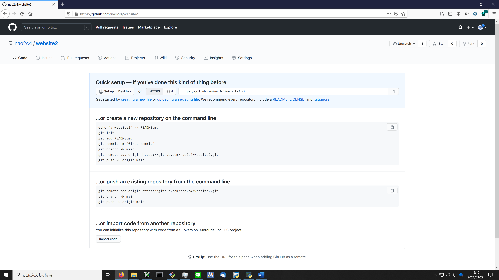
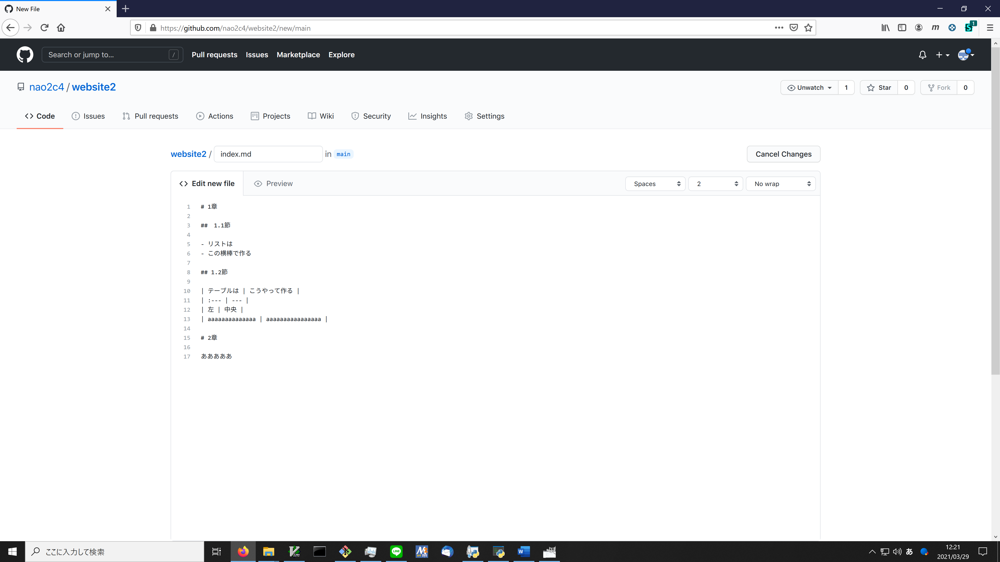
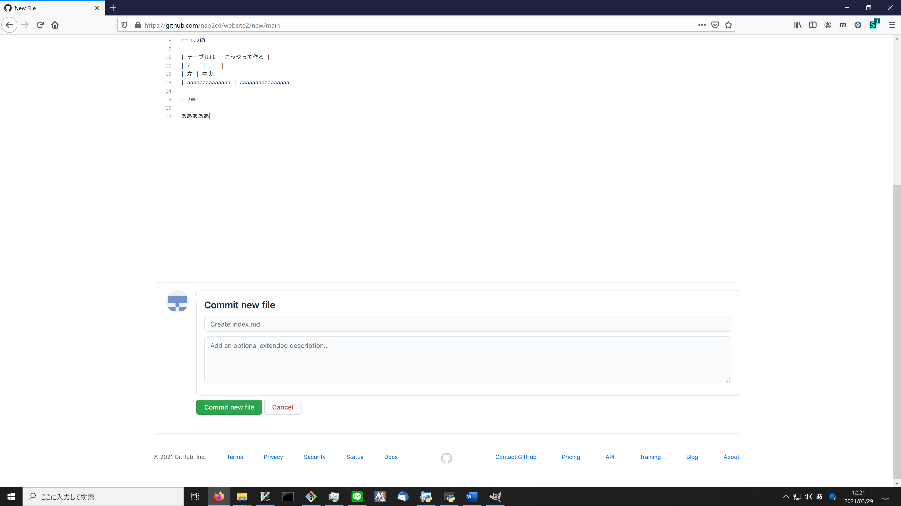
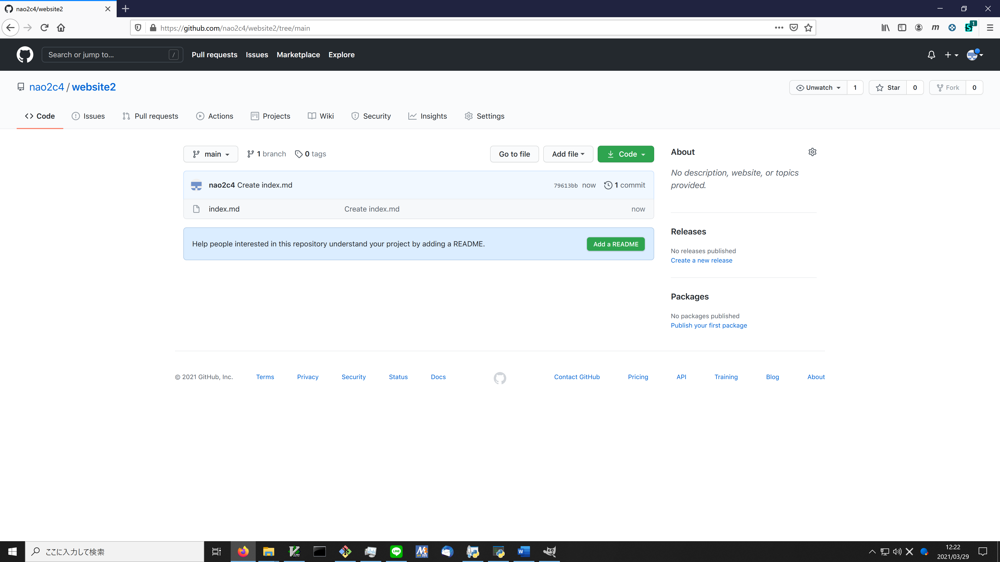
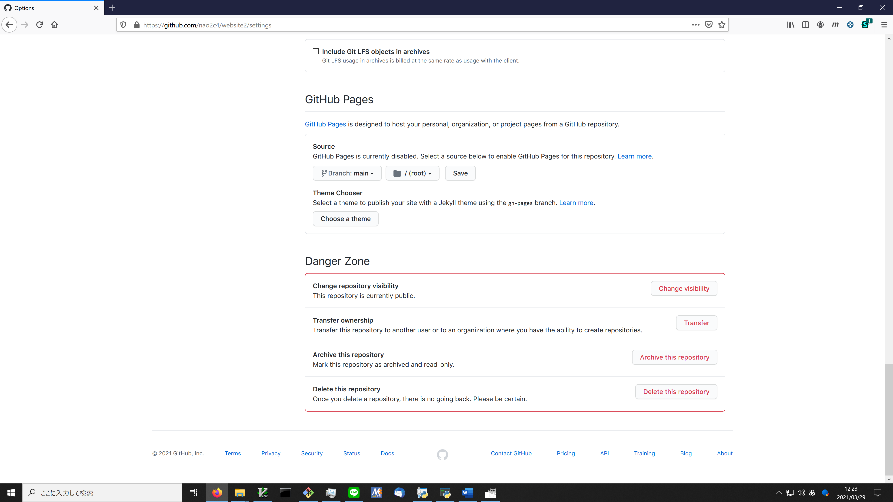
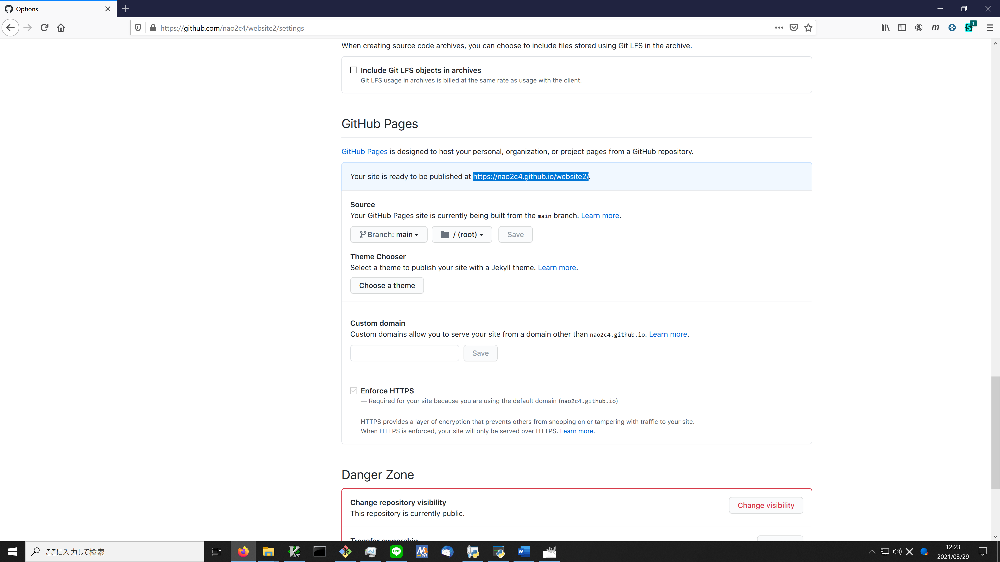
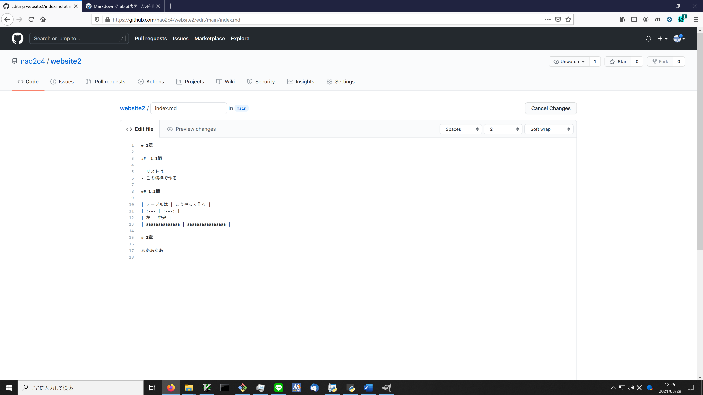
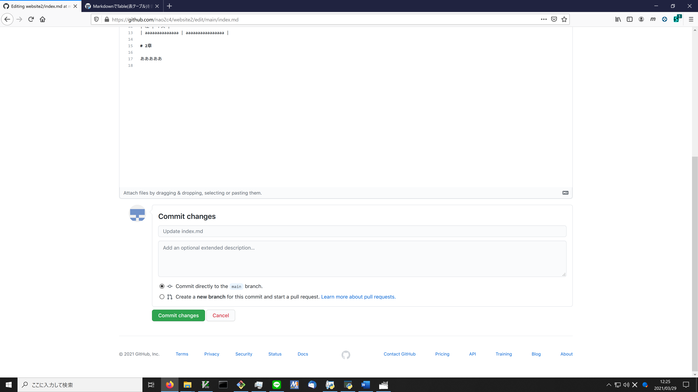
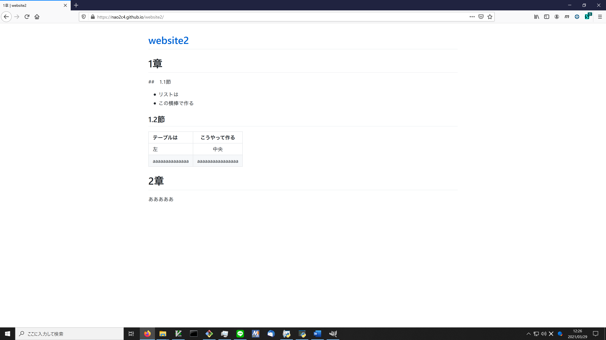

# Github pagesの作り方

まずGitHubでリポジトリを作る．
やり方 → [リンク](https://docs.github.com/ja/github/getting-started-with-github/create-a-repo)

可能なら`{アカウント名}.github.io`のほうが後々楽かも．
僕なら`nao2c4.github.io`になる．

`creating a new file`をクリック

適当にファイルを作る．

保存するために，`Commit new file`を押す．

リポジトリのページに行く．

ページの設定をするために`Settings`を開く．

GitHub Pagesの欄を適当に設定する．

`Save`.

リンクが出現するので移動する．
このURLが公開ページになる．

ページを見るとたまたま表がミスってたので編集．

編集．

変更を保存．
`Commit changes`

完了！
